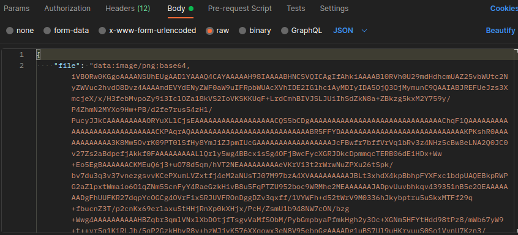
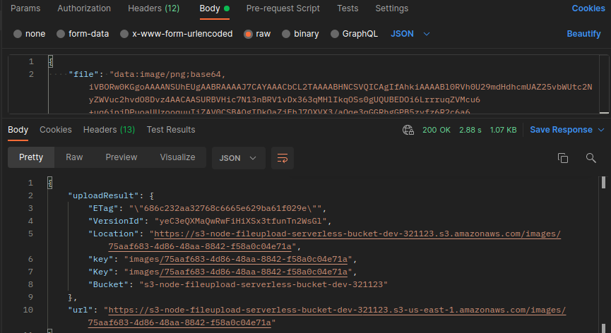

# Serverless File Upload API using Amazon S3, API Gateway & AWS Lambda

## Problem 
Build a serverless architeture to upload media files from different users into your application

## Services
- [API Gateway](https://docs.aws.amazon.com/api-gateway/): APIs act as the "front door" for front-end applications, and secure APIs at any scale. 
- [Lambda function](https://aws.amazon.com/lambda/): Serverless function that can run code without provisioning or managing infrastructure. 
- [S3](https://aws.amazon.com/s3/): Object storage built to retrieve any amount of data from anywhere.

## Project

- Receives a base64 encoded string file from API Gateway and send to s3 through the lambda.
- To make a base64 file [click here](https://easy64.org/convert-file-to-base64/) to use easy64 website
- Because it's only allowed media files, mime type is verified and if is not found or it's not a media file an exception is thrown.
- Once file is successfully verified, it will be uploaded to the s3
 
Body example  

 
The response should be this:  
 

